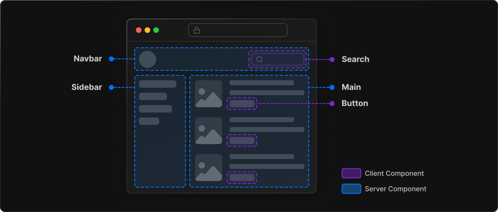

- [원본 링크](https://beta.nextjs.org/docs/getting-started)

# Getting Started(시작하기)

> ### Next.js 문서는 두 개의 사이트로 나뉩니다:  
>
> <strong> [Next 13 App Router (beta) docs](https://beta.nextjs.org/docs/getting-started)<strong> (당신이 현재 읽고 있는 페이지입니다.): Try out React 서버, Components(컴포넌트), Streaming(스트리밍), new data fetching(새로운 데이터 패칭) 등을 소개합니다.   > <strong>[Next 13 (stable) docs](https://nextjs.org/docs)<strong> : 폰트 최적화, 이미지 업데이트, 링크(LINK) 와 스크립트 컴포넌트 등을 소개합니다.  

## App Router 소개

- 지난 몇 달 동안 Next.js 팀은 Next.js와 [React 서버 컴포넌트](../Building_Your_Application/Rendering/Server_and_Client_Components.md) 및 [React 18 기능](https://react.dev/blog/2022/03/29/react-v18)을 통합하기 위해 노력해왔습니다. 이제 새로운 앱 디렉토리에서 이러한 새로운 기능을 사용해 볼 수 있습니다.  
  > 🚧앱 라우터는 현재 베타 버전으로 운영 환경에서는 사용하지 않는 것이 좋습니다.

## 특징 개요(Features Overview)

다음은 [App Router](../Building_Your_Application/Routing/Fundamentals.md)의 새로운 기능에 대한 요약 입니다. :

<table><thead><tr><th>Features</th><th>What's New?</th></tr></thead><tbody><tr><td><a href="../Building_Your_Application/Routing/Fundamentals.md" class="relative">Routing</a></td><td>레이아웃, 중첩 라우팅, 로딩 상태, 오류 처리 등을 지원하는 서버 컴포넌트 위에 구축된 새로운 파일 시스템 기반 라우터입니다.</td></tr><tr><td><a href="../Building_Your_Application/Rendering/Fundamentals.md" class="relative">Rendering</a></td><td> Client 컴포넌트와 Server 컴포넌트를 활용한 Client-side 와 Server-side Rendering. 서버의 정적 렌더링과 동적 렌더링은 Next.js를 통해 더욱 최적화됩니다. Edge 및 Node.js runtime의 스트리밍.</td></tr><tr><td><a href="../Building_Your_Application/Data_Fetching/Fundamentals.md" class="relative">Data Fetching</a></td><td>React 컴포넌트에서 <code class="inline">async</code>/<code class="inline">await</code>  지원을 통한 간소화된 데이터 불러오기 및 React 및 웹 플랫폼에 부합하는  <code class="inline">fetch()</code> API. </td></tr><tr><td>Caching</td><td>Server Components 와 client-side navigation에 최적화된 새로운 <a href="../Building_Your_Application/Data_Fetching/Fundamentals.md" class="relative">Next.js HTTP Cache</a> 와 <a href= "./Building_Your_Application/Routing/Linking_and_Navigating.md" class="relative">client-side cache</a> </td></tr><tr><td>Optimizations(최적화)</td><td> native browser lazy loading을 활용해서 <a href="./Building_Your_Application/Optimizing/Images.md" class="relative">Image Component</a>를 개선했습니다. 자동 글꼴 최적화 기능을 갖춘 새로운 <a href="./Building_Your_Application/Optimizing/Fonts.md" class="relative">Font Module</a> </td></tr><tr><td><a href="../Building_Your_Application/Configuring/next.config.js.md" class="relative">Transpilation(트랜스파일링)</a></td><td>로컬 패키지(예: 모노레포스) 또는 외부 종속성(예: node_modules)에서 종속성을 자동으로 트랜슬레이션하고 번들링합니다.</td></tr><tr><td>API</td><td>Next.js 전반에 걸친 API 디자인 업데이트. 새로운 API는 API 참조 섹션을 참조하세요.</td></tr><tr><td>Tooling</td><td>Rust를 기반으로 해서 Webpack 보다 700배 빠른 <a href="https://turbo.build/pack" class="absolute" target="_blank" rel="noopener noreferrer">Turbopack</a>을 소개합니다. </td></tr></tbody></table>

## Thinking in Server Components(서버 컴포넌트로 사고하기)

[React가 UI를 구축하는 방식을 바꾼 것과 유사하게](https://react.dev/learn/thinking-in-react), React Server Components는 [서버와 클라이언트](../Building_Your_Application/Rendering/Server_and_Client_Components.md)를 활용하는 하이브리드 애플리케이션을 구축하기 위한 새로운 사고 모델(new mental model)을 도입했습니다. 
이제 React는 전체 애플리케이션을 클라이언트 측에서 렌더링(client-side-rendering, CSR)하는 대신 컴포넌트의 목적에 따라 렌더링할 위치를 선택할 수 있는 유연성을 제공합니다. 
예를 들어 Next.js 애플리케이션의 [페이지](https://nextjs.org/docs/basic-features/pages)를 생각해 보세요:

페이지를 더 작은 컴포넌트로 분할하면 대부분의 컴포넌트가 비반응형(Non-interactive)이며 서버에서 렌더링하여 서버 컴포넌트로 렌더링 할 수 있습니다. 더 작은 반응형(interactive) UI의 경우 클라이언트 컴포넌트를 뿌릴 수 있습니다. 이는 Next.js의 서버 우선 접근 방식과 일치합니다.  
이 전환을 더 쉽게 하기 위해 서버 컴포넌트가 app 디렉토리의 기본값으로 설정되어 있기에 추가 단계를 수행하지 않아도 됩니다. 그렇기에 필요할 때만 클라이언트 컴포넌트를 선택할 수(opt-in) 있습니다.  
자세한 내용은 [서버 및 클라이언트 컴포넌트 가이드](../Building_Your_Application/Rendering/Server_and_Client_Components.md)를 참조하세요.

## Giving Feedback(피드백을 부탁드립니다!)

 
 새 문서를 작업하는 동안 여러분의 피드백을 기다립니다. Vercel 계정으로 <a href="https://vercel.com/docs/concepts/deployments/comments">댓글</a>을 달고 페이지에 직접 피드백을 남길 수 있습니다.
   

- 오타 및 기타 사소한 실수.
- 혼란스럽거나 불명확한 설명.
- 누락된 정보.
- 문서를 읽는 동안 궁금했던 점.
    
  Next.js 기능 및 API 디자인에 대한 피드백은
  [GitHub Disscussions](https://github.com/vercel/next.js/discussions/41745)을 이용하세요.

## 방향 선택하기!

마침내 시작합니다. 당신은 무엇을 하고 싶으신가요?

> ### [새로운 Next.js App 만들기](./Installation.md)
>
> APP Router의 새로운 기능 사용법에 대해서 학습하세요.(beta)

  

> ### [기존의 Next.js App 수정하기(Migrate)](./Upgrade_Guide.md)
>
> 어떻게 Next.js가 당신의 코드를 사용자 인터페이스로 변화시키는지 학습하세요

  

> ### [App Directory Roadmap 보기](./App_Router_Roadmap.md)
>
> stable, in-progress 그리고 새로운 Next.js의 특징에 대해서 학습해보세요

  

[다음페이지(Installation)](./Installation.md)
