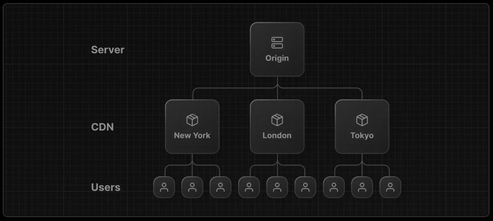

# 데이터 가져오기

Next.js 앱 라우터는 React와 웹 플랫폼 기반으로 구축된 새로운 단순화된 데이터 가져오기 시스템을 소개합니다. 이 페이지에서는 데이터 수명주기를 관리하는 데 도움이 되는 기본 개념과 패턴을 살펴볼 것입니다.

이 페이지의 권장 사항을 간단히 알아보겠습니다:

1. **[서버에서 데이터 가져오기](https://nextjs.org/docs/app/building-your-application/data-fetching#fetching-data-on-the-server)** - 서버 컴포넌트를 사용하여 데이터를 가져옵니다.
2. **[병렬로 데이터 가져오기](https://nextjs.org/docs/app/building-your-application/data-fetching#parallel-and-sequential-data-fetching)** - 폭포식 효과를 최소화하고 로딩 시간을 줄이기 위해 데이터를 병렬로 가져옵니다.
3. 레이아웃과 페이지에 대해 **[사용하는 위치에서 데이터 가져오기](https://nextjs.org/docs/app/building-your-application/data-fetching#automatic-fetch-request-deduping)** - Next.js는 트리 내에서 요청을 자동으로 중복 처리합니다.
4. **[로딩 UI, 스트리밍 및 Suspense 사용](https://nextjs.org/docs/app/building-your-application/data-fetching#streaming-and-suspense)** - 페이지를 점진적으로 렌더링하고 나머지 콘텐츠가 로드되는 동안 사용자에게 결과를 표시하는 데 사용합니다.

## **[The `fetch()` API](https://nextjs.org/docs/app/building-your-application/data-fetching#the-fetch-api)**

새로운 데이터 가져오기 시스템은 기본 **`fetch()`** 웹 API를 기반으로 구축되었으며, 서버 컴포넌트에서 **`async`**와 **`await`**를 활용합니다.

- React는 **`fetch`**를 확장하여 **[자동 요청 중복 처리](https://nextjs.org/docs/app/building-your-application/data-fetching#automatic-fetch-request-deduping)**을 제공합니다.
- Next.js는 **`fetch`** 옵션 객체를 확장하여 각 요청이 자체적으로 **[캐싱 및 재유효화](https://nextjs.org/docs/app/building-your-application/data-fetching/caching)** 규칙을 설정할 수 있게 합니다.

Next.js에서 **`fetch`**를 사용하는 방법을 알아보겠습니다.

## **[서버에서 데이터 가져오기](https://nextjs.org/docs/app/building-your-application/data-fetching#fetching-data-on-the-server)**

가능한 경우에는 **[서버 컴포넌트](https://nextjs.org/docs/getting-started/react-essentials#server-components)**에서 데이터를 가져오는 것을 권장합니다. 서버 컴포넌트는 항상 서버에서 데이터를 가져옵니다. 이를 통해 다음과 같은 이점을 얻을 수 있습니다:

- 백엔드 데이터 리소스(예: 데이터베이스)에 직접 액세스할 수 있습니다.
- 액세스 토큰 및 API 키와 같은 민감한 정보가 클라이언트에 노출되지 않도록하여 응용 프로그램을 보다 안전하게 유지할 수 있습니다.
- 데이터를 가져와서 동일한 환경에서 렌더링할 수 있습니다. 이는 클라이언트와 서버 간의 번갈아가는 통신과 클라이언트의 주 스레드 작업을 줄여줍니다.
- 클라이언트에서 여러 데이터를 한 번의 라운드 트립으로 가져올 수 있습니다.
- 클라이언트-서버의 [폭포식 효과](https://nextjs.org/docs/app/building-your-application/data-fetching#parallel-and-sequential-data-fetching)을 줄일 수 있습니다.
- 지역에 따라 데이터 가져오기가 데이터 소스에 가까워져 지연 시간이 감소하고 성능이 향상될 수도 있습니다.

알아두면 좋은 점: 여전히 클라이언트 측에서 데이터를 가져올 수 있습니다. 클라이언트 컴포넌트에서는 SWR이나 React Query와 같은 타사 라이브러리를 사용하는 것이 좋습니다. 미래에는 React의 use() hook을 사용하여 클라이언트 컴포넌트에서 데이터를 가져올 수도 있게 될 것입니다.

## **[컴포넌트 수준에서 데이터 가져오기](https://nextjs.org/docs/app/building-your-application/data-fetching#fetching-data-at-the-component-level)**

앱 라우터에서는 [레이아웃(layouts)](https://nextjs.org/docs/app/building-your-application/routing/pages-and-layouts#layouts), [페이지(pages)](https://nextjs.org/docs/app/building-your-application/routing/pages-and-layouts#pages), 그리고 컴포넌트 내에서 데이터를 가져올 수 있습니다. 데이터 가져오기는 [스트리밍(Streaming)과 서스펜스(Suspense)](https://nextjs.org/docs/app/building-your-application/data-fetching#streaming-and-suspense)와도 호환됩니다.

알아두면 좋은 점: 레이아웃(layouts)에서는 부모 레이아웃과 자식 컴포넌트 간에 데이터를 전달할 수 없습니다. 동일한 데이터를 경로(route)에서 여러 번 요청하더라도 해당 데이터가 필요한 레이아웃 내에서 직접 데이터를 가져오는 것을 권장합니다. React와 Next.js는 내부적으로 요청을 [캐시하고 중복](https://nextjs.org/docs/app/building-your-application/data-fetching#automatic-fetch-request-deduping)을 제거하여 동일한 데이터가 여러 번 가져와지는 것을 피합니다.

## \***\*[병렬 및 순차 데이터 가져오기](https://nextjs.org/docs/app/building-your-application/data-fetching#parallel-and-sequential-data-fetching)\*\***

컴포넌트 내에서 데이터를 가져올 때, 두 가지 데이터 가져오기 패턴인 "병렬"과 "순차"에 대해 알아야 합니다.

- **병렬 데이터 가져오기**는 경로(route) 내에서 요청이 즉시 시작되며 데이터를 동시에 로드합니다. 이로 인해 클라이언트-서버 폭포식 효과는 줄어들고 데이터 로드에 걸리는 총 시간이 단축됩니다.
- **순차 데이터 가져오기**는 경로 내의 요청이 서로 종속되어 워터폴을 형성합니다. 한 번의 가져오기가 다른 결과에 의존하거나 다음 가져오기 전에 조건을 충족시키기 위해 이 패턴을 원하는 경우도 있을 수 있습니다. 그러나 이 동작은 의도하지 않게 발생하여 로딩 시간이 더 오래 걸릴 수도 있습니다.

[병렬 및 순차 데이터 가져오기를 구현하는 방법을 배우세요.](https://nextjs.org/docs/app/building-your-application/data-fetching/fetching#data-fetching-patterns)

## **[자동 fetch() 요청 중복 제거](https://nextjs.org/docs/app/building-your-application/data-fetching#automatic-fetch-request-deduping)**

트리 내에서 여러 컴포넌트에서 동일한 데이터(예: 현재 사용자)를 가져와야 하는 경우, Next.js는 동일한 입력을 가진 fetch 요청(GET)을 자동으로 임시 캐시에 저장합니다. 이 최적화를 통해 렌더링 과정에서 동일한 데이터가 여러 번 가져와지는 것을 방지합니다.

- 서버에서는 캐시가 서버 요청의 수명 동안 유지되며 렌더링 프로세스가 완료될 때까지 유지됩니다.
  - 이 최적화는 레이아웃(Layouts), 페이지(Pages), 서버 컴포넌트(Server Components), generateMetadata 및 generateStaticParams에서 이루어지는 fetch 요청에 적용됩니다.
  - 이 최적화는 **[정적 생성(static generation)](https://nextjs.org/docs/app/building-your-application/rendering#static-rendering)** 중에도 적용됩니다.
- 클라이언트에서는 캐시가 세션의 기간 동안 유지되며 (여러 번의 클라이언트 측 재렌더링을 포함할 수 있는) 전체 페이지 새로고침이 이루어지기 전까지 유지됩니다.

알아두면 좋은 점: POST 요청은 자동으로 중복 제거되지 않습니다. [캐싱에 대해 더 알아보세요.](https://nextjs.org/docs/app/building-your-application/data-fetching/caching)
fetch를 사용할 수 없는 경우, React는 수동으로 데이터를 요청 기간 동안 캐싱할 수 있도록 [캐시 함수](https://nextjs.org/docs/app/building-your-application/data-fetching/caching#react-cache)를 제공합니다.

## **[정적 및 동적 데이터 가져오기](https://nextjs.org/docs/app/building-your-application/data-fetching#static-and-dynamic-data-fetching)**

두 가지 유형의 데이터가 있습니다: **정적 데이터**와 **동적 데이터**.

- **정적 데이터**는 자주 변경되지 않는 데이터입니다. 예를 들어, 블로그 글이 있습니다.
- **동적 데이터**는 자주 변경되거나 사용자에게 특정할 수 있는 데이터입니다. 예를 들어, 쇼핑 카트 목록이 있습니다.

기본적으로 Next.js는 자동으로 정적 데이터 가져오기를 수행합니다. 이는 데이터가 빌드 시간에 가져와 캐시되며 각 요청마다 재사용된다는 것을 의미합니다. 개발자로서 정적 데이터가 어떻게 캐시되고 재검증되는지에 대한 제어권을 가지고 있습니다.

정적 데이터를 사용하는 두 가지 이점이 있습니다:

1. 요청 수를 최소화하여 데이터베이스의 부하를 줄입니다.
2. 데이터는 자동으로 캐시되어 로딩 성능이 향상됩니다.

하지만 데이터가 사용자에게 맞춤화되거나 항상 최신 데이터를 가져오길 원한다면 요청을 "동적"으로 표시하고 캐시 없이 각 요청마다 데이터를 가져올 수 있습니다.

**[정적 및 동적 데이터 가져오기 방법 알아보기](https://nextjs.org/docs/app/building-your-application/data-fetching/fetching#static-data-fetching)**.

## **[데이터 캐싱](https://nextjs.org/docs/app/building-your-application/data-fetching#caching-data)**

캐싱은 데이터를 저장소(예: **[콘텐츠 전달 네트워크](https://vercel.com/docs/concepts/edge-network/overview)**)에 저장하여 각 요청마다 원본 소스에서 다시 가져오지 않아도 되는 과정입니다.

**Next.js 캐시**는 전역적으로 분산될 수 있는 영속적인 **[HTTP 캐시](https://developer.mozilla.org/en-US/docs/Web/HTTP/Caching)**입니다. 이는 캐시가 자동으로 확장되고 플랫폼에 따라 여러 지역에서 공유될 수 있다는 것을 의미합니다(예: **[Vercel](https://vercel.com/docs/concepts/next.js/overview)**).

Next.js는 **`fetch()`** 함수의 **[옵션 객체](https://developer.mozilla.org/en-US/docs/Web/API/fetch#:~:text=preflight%20requests.-,cache,-A%20string%20indicating)**를 확장하여 각 서버 요청마다 자체적인 영속적 캐싱 동작을 설정할 수 있게 합니다. 이는 **[컴포넌트 수준의 데이터 가져오기](https://nextjs.org/docs/app/building-your-application/data-fetching#fetching-data-at-the-component-level)**와 함께 사용하여 데이터가 사용되는 곳에서 직접 캐싱을 구성할 수 있게 합니다.

서버 렌더링 중에 Next.js는 fetch를 만나면 캐시를 확인하여 데이터가 이미 있는지 확인합니다. 데이터가 캐시에 있다면 캐시된 데이터를 반환합니다. 그렇지 않은 경우 데이터를 가져와서 향후 요청을 위해 저장합니다.

알아두면 좋은 점: 만약 fetch를 사용할 수 없는 경우, React는 요청 기간 동안 데이터를 수동으로 캐시할 수 있도록 cache 함수를 제공합니다.

[Next.js에서 캐싱에 대해 더 알아보세요.](https://nextjs.org/docs/app/building-your-application/data-fetching/caching)

### **[데이터 재검증](https://nextjs.org/docs/app/building-your-application/data-fetching#revalidating-data)**

재검증은 캐시를 삭제하고 최신 데이터를 다시 가져오는 과정을 말합니다. 데이터가 변경되고 전체 애플리케이션을 다시 빌드하지 않고도 최신 버전을 표시하려는 경우 유용합니다.

Next.js는 두 가지 유형의 재검증을 제공합니다:

- **[백그라운드 재검증](https://nextjs.org/docs/app/building-your-application/data-fetching/revalidating#background-revalidation)**: 특정 시간 간격마다 데이터를 재검증합니다.
- **[요청에 따른 재검증](https://nextjs.org/docs/app/building-your-application/data-fetching/revalidating#on-demand-revalidation)**: 업데이트가 있을 때마다 데이터를 재검증합니다.

**[데이터 재검증 방법 알아보기](https://nextjs.org/docs/app/building-your-application/data-fetching/revalidating)**.

### **[스트리밍과 Suspense](https://nextjs.org/docs/app/building-your-application/data-fetching#streaming-and-suspense)**

스트리밍과 **[Suspense](https://react.dev/reference/react/Suspense)**은 새로운 React 기능으로, UI의 렌더링 단위를 점진적으로 렌더링하고 클라이언트로부터 단계적으로 스트리밍할 수 있게 해줍니다.

서버 컴포넌트와 **[중첩된 레이아웃](https://nextjs.org/docs/app/building-your-application/routing/pages-and-layouts)**을 사용하면 데이터가 필요하지 않은 페이지의 일부를 즉시 렌더링하고, 데이터를 가져오는 페이지의 일부에는 **[로딩 상태](https://nextjs.org/docs/app/building-your-application/routing/loading-ui-and-streaming)**를 표시할 수 있습니다. 이는 사용자가 전체 페이지가 로드될 때까지 기다릴 필요 없이 상호작용을 시작할 수 있도록 해줍니다.

스트리밍과 Suspense에 대해 더 알아보려면 **[로딩 UI](https://nextjs.org/docs/app/building-your-application/routing/loading-ui-and-streaming)** 및 **[스트리밍과 Suspense](https://nextjs.org/docs/app/building-your-application/data-fetching#streaming-and-suspense)** 페이지를 참조하십시오.

## **[이전 방법들](https://nextjs.org/docs/app/building-your-application/data-fetching#old-methods)**

이전의 Next.js 데이터 페칭 방법인 **`getServerSideProps`**, **`getStaticProps`**, 그리고 **`getInitialProps`**은 새로운 App Router에서 **지원되지 않습니다**. 하지만 여전히 **[Pages Router](https://nextjs.org/docs/pages/building-your-application/data-fetching)**에서 사용할 수 있습니다.

## **[다음 단계](https://nextjs.org/docs/app/building-your-application/data-fetching#next-steps)**

이제 Next.js에서 데이터 페칭의 기본 원리를 이해했으니, 애플리케이션에서 데이터를 관리하는 방법에 대해 더 알아볼 수 있습니다:
