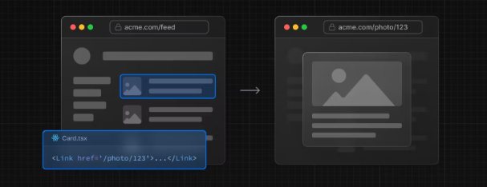
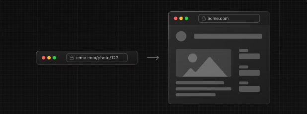
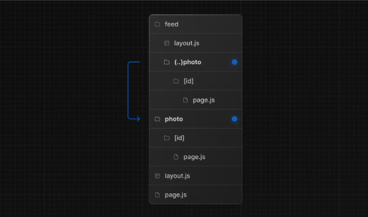
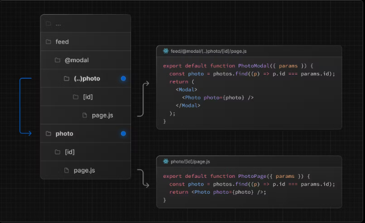

https://nextjs.org/docs/app/building-your-application/routing/intercepting-routes
위 문서에 대한 번역을 진행합니다.

번역시점은 05-08로 공식문서의 추가적인 업데이트가 있을 수 있습니다.

번역기와 챗지피티에 의존해서 번역하고있습니다.

번역체를 자연스러운 어투로 옮기는 과정에서 오역이 발생할 수 있는 점 미리 알립니다.

# Intercepting Routes
`intercepting Routes`를 이용하면 현재 페이지의 컨텍스트를 유지하면서 현재 레이아웃 내에서 경로를 로드할 수 있습니다.

이 라우팅 패러다임은 특정 경로를 가로채서 다른 경로를 표시하려는 경우에 유용할 수 있습니다.

 

예컨대 피드 내에서 사진을 클릭하면 피드에 오버레이되는 모달이 사진과 함께 표시되어야 합니다.

이런 경우 Next.js는 `/feed` 경로를 가로채고 이 URL을 "masks" 하여 `/photo/123`을 대신 표시합니다.

그러나 공유 가능한 URL을 클릭하거나 페이지를 새로 고침하여 사진으로 직접 이동하는 경우에는 모달 대신 전체 사진 페이지가 렌더링 되어야 합니다.

경로 차단이 발생하지 않아야합니다. (역주 : No Route interception should occur )

# Convention
`inercepting routes`는 (...) 규칙을 사용하여 정의할 수 있습니다.

이는 상대 경로 규칙 .../ 과 매우 유사하지만 세그먼트의 경우입니다.

 

이렇게 사용할 수 있습니다.

- (.) 을 사용하여 같은 수준의 세그먼트를 일치시킬 수 있습니다.

- (..)을 사용하여 한 수준 위의 세그먼트를 일치 시킬 수 있습니다.

- (..)(..)을 사용하여 두 수준 위의 세그먼트와 일치 시킬 수 있습니다.

- (...) 을 사용하여 루트 앱 디렉토리에서 세그먼트를 일치시킬 수 있습니다.

 

예컨대 (..) photo 디렉토리를 만들어서 feed 세그먼트 내에서 photo 세그먼트를 가로챌 수 있습니다. 

 

(..) 규칙은 파일 시스템이 아닌 경로 세그먼트를 기준으로 한다는 점을 유의하십시오

# Example

## Modals

`intercepting Routes`와 `parallel Routes`를 함께 사용하는 것을 통해 modal을 만들 수 있습니다.

이러한 패턴을 사용하여 모달을 만들게 되면 모달을 만들 때 흔하게 발생하는 몇 가지 문제를 해결할 수 있습니다.

 

- URL을 통해 모달 콘텐츠를 공유할 수 있도록 만들기

- 페이지가 새로 고쳐질 때 모달을 닫지 않고 컨텍스트를 유지하기

- 이전 경로로 이동하지 않고 뒤로 탐색할 때 모달을 닫기

- 앞으로 탐색하는 경우 모달을 다시 열기

위 사진의 예제에서 @modal은 세그먼트가 아니라 슬롯이므로 사진 세그먼트의 경로는 (..)일치자를 사용할 수 있습니다. 즉 사진 경로는 파일 시스템 레벨이 두개 더 높지만 세그먼트 레벨은 한개만 더 높습니다.

 

다른 예로는 상단 탐색 모음에 로그인 모달을 열면서 전용 `/login` 페이지가 있거나 사이드 모달에서 쇼핑카트를 여는 것 등이 있습니다.