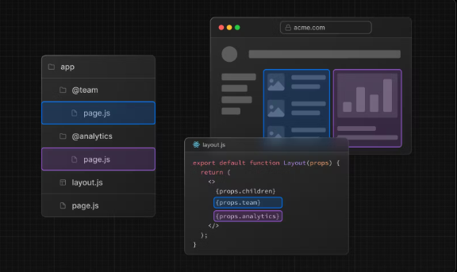
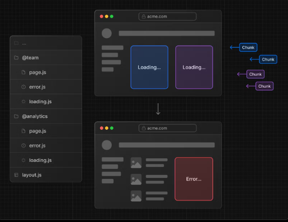
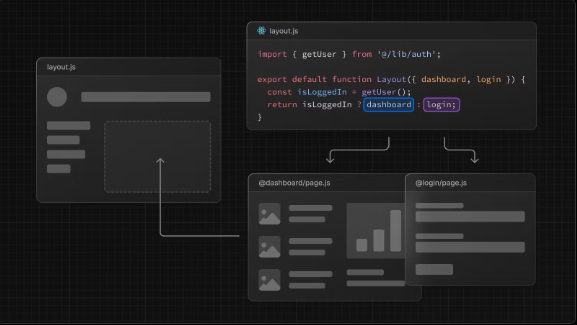
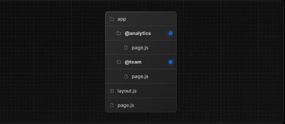
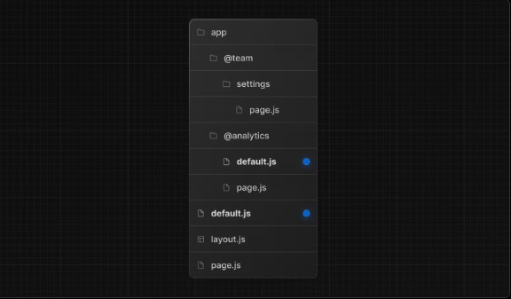
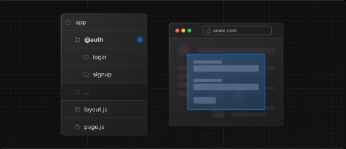
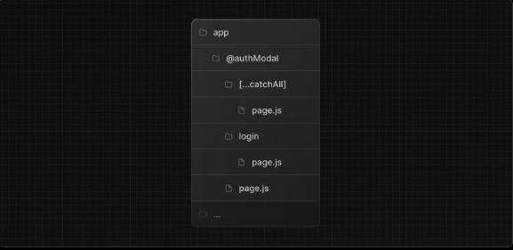

https://nextjs.org/docs/app/building-your-application/routing/parallel-routes
위 문서에 대한 번역을 진행합니다.

번역시점은 2023-05-07로 공식문서의 추가적인 업데이트가 있을 수 있습니다.

번역기와 챗지피티에 의존해서 번역하고있습니다.

번역체를 자연스러운 어투로 옮기는 과정에서 오역이 발생할 수 있는 점 미리 알립니다.


# Parallel Routing

`Parallel Routing`(병렬 라우팅)을 사용하면 동일한 레이아웃에서 하나 이상의 페이지를 동시에 혹은 조건부로 렌더링을 할 수 있습니다.

소셜 사이트의 대시보드나 피드와 같이 앱에서 매우 동적인 섹션의 경우 병렬 라우팅을 이용하여 복잡한 라우팅 패턴을 구현할 수 있습니다.

 

예컨대 팀 페이지와 분석 페이지를 동시에 렌더링 하는 것이 가능합니다.




병렬 라우팅을 사용하면 각 경로가 독립적으로 스트리밍 될 때 각 경로에 대해 독립적으로 오류, 로딩 상태를 정의할 수 있습니다.

 


병렬 라우팅을 사용하면 인증 상태와 같이 특정 조건에 따라서 조건부로 슬롯을 렌더링할 수도 있습니다.

이를 통해 동일한 URL 에서 완전히 분리된 코드를 사용할 수 있습니다.

> 역주: slot based on certain conditions라는 표현인데 slot이 정확히 어떤 것을 지칭하는지 잘 모르겠습니다.

 

# Convention

Parallel Routes는 named slots을 사용하여 생성됩니다.

Slots은 @folder 규칙으로 정의되며 props와 동일한 수준의 레이아웃으로 전달됩니다.

```
slots은 route segments가 아니고 URL 구조에 영향을 미치지도 않습니다.

파일 경로 /@team/members는 /members에 액세스할 수 있습니다.
```

예를 들어 다음 파일 구조는 두개의 명시적인 slots을 정의합니다.

@analytics와 @team이 그것입니다.

 

위 사진의 폴더 구조는 app/layout.js의 컴포넌트가 @analytics 및 @team  slots props를 허용하고

하위 프로퍼티와 함께 병렬적으로 렌더링 할 수 있다는 것을 의미합니다.

```tsx
app/layout.tsx

export default function Layout(props: {
  children: React.ReactNode;
  analytics: React.ReactNode;
  team: React.ReactNode;
}) {
  return (
    <>
      {props.children}
      {props.team}
      {props.analytics}
    </>
  );
}
```

```
Good to know
children prop 은 폴더에 매핑할 필요가 없는 암시적인 슬롯입니다.
따라서 app/page.js는 app/@children/page.js와 동일합니다.
Unmatched Routes
기본적으로 슬롯 내에서 렌더링 되는 콘텐츠는 현재 URL과 일치합니다.

일치하지 않는 슬롯의 경우에는 Next.js가 렌더링 하는 내용은 라우팅 테크닉과 폴더 구조에 따라 다릅니다.
```
 

# Unmatched Routes

## `default.js`

Next.js가 현재 URL을 기반으로 슬롯의 활성 상태를 복구할 수 없을 때 대체 파일로 렌더링할 `default.js` 파일을 정의할 수 있습니다.

다음과 같은 폴더 구조를 고려해보세요

@team 슬롯에는 settings 폴더가 있지만 @analytics 폴더에는 settings 폴더가 없는 구조입니다.

 

만약 root / 에서 / settings까지 탐색하는 경우에는 탐색 유형과 default.js 파일의 사용 가능 여부에 따라 렌더링 되는 콘텐츠가 달라지게 됩니다.

|             | With @analytics/default.js              | Without @analytics/default.js           |
|-------------|----------------------------------------|----------------------------------------|
| Soft Navigation | @team/settings/page.js and @analytics/page.js | @team/settings/page.js and @analytics/page.js |
| Hard Navigation | @team/settings/page.js and @analytics/default.js | 404 error | 


## soft navigation
next.js에서 이야기하는 soft navigation은 현재 url과 일치하지 않더라도 슬롯이 이전에 활성화되었던 상태를 렌더링 하는 것을 의미합니다.

## hard navigation
hard navigation(전체 페이지를 다시 로드해야하는 탐색)에서 Next.js는 먼저 일치하지 않는 슬롯의 default.js 파일을 렌더링 하려고 시도합니다.

만약 해당 파일이 사용 불가능한 경우 404 error가 렌더링됩니다.

```
일치하지 않는 경로에 대한 404는 병렬 렌더링해서는 안되는 경로가 실수로 렌더링 되는 것을 방지하는 데에 도움이 됩니다.
 ```

# `useSelectedLayoutSegments(s)`


`useSelectedLayoutSegment(s)`는 모두 해당 슬롯 내에서 활성화 되어있는 경로 세그먼트를 읽을 수 있는 `parallelRoutesKey`를 허용합니다.

```tsx
app/layout.tsx
"use client";
import { useSelectedLayoutSegment } from "next/navigation";
 
export default async function Layout(props: {
  ...
  authModal: React.ReactNode;
}) {
  const loginSegments = useSelectedLayoutSegment("authModal")
  ...
}
```
사용자가 URL 표시줄에서 @authModal/login 또는 /login으로 이동하면 로그인 세그먼트는 "login" 문자열과 같습니다.

 

# Examples
## Modals
병렬 라우팅을 사용하여 모달을 렌더링 할 수도 있습니다.
 


@authModal 슬롯은 일치하는 경로로 이동하여 표시할 수 있는 <modal> 컴포넌트를 렌더링합니다.

```tsx
app/layout.tsx
export default async function Layout(props: {
  ...
  authModal: React.ReactNode;
}) {
  return (
    <>
      ...
      {props.authModal}
    </>
  );
}
app/@authModal/login/page.tsx
import { Modal } from 'components/modal';
 
export default function Login() {
  return (
    <Modal>
      <h1>Login</h1>
      ...
    </Modal>
  );
}
```
모달이 활성화 되어 있지 않을 때 모달의 콘텐츠가 렌더링 되지 않도록 하려면 null을 반환하는 default.js 파일을 만들면 됩니다.

```tsx
export default function Default() {
  return null;
}
 ```

## Dismissing a modal
모달 해제하기

 

클라이언트 탐색을 통해 모달이 시작된 경우 (<Link href="/login")>을 사용한 경우 등) `router.back()`을 호출하거나 링크 컴포넌트를 사용하여 모달을 해제할 수 있습니다.

```tsx
app/@authModal/login/page.tsx
'use client';
import { useRouter } from 'next/navigation';
import { Modal } from 'components/modal';
 
export default async function Login() {
  const router = useRouter();
  return (
    <Modal>
      <span onClick={() => router.back()}>Close modal</span>
      <h1>Login</h1>
      ...
    </Modal>
  );
}
```

```
모달에 대한 자세한 내용은 경로 가로채기 섹션에서 다룹니다.
```

다른 곳으로 이동하여 모달을 해제하는 것을 원하는 경우에는 catch-all route를 이용할 수 있습니다.

 


```js
app/@authModal/[...catchAll]/page.js
export default function CatchAll() {
  return null;
}
```
Catch-all routes는 default.js 보다 우선시됩니다.

 

# Conditional Routes
병렬 라우트를 사용하여 조건부 라우팅을 구현할 수도 있습니다.

예를 들어서 인증 상태에 따라 @dashboard 또는 @login  경로를 렌더링할 수 있습니다.

```tsx
app/layout.tsx
import { getUser } from '@/lib/auth';
 
export default function Layout({ params, dashboard, login }) {
  const isLoggedIn = getUser();
  return isLoggedIn ? dashboard : login;
}
```