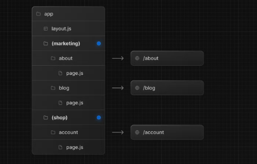
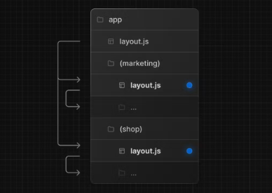
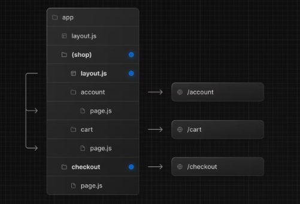
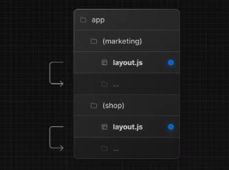

https://nextjs.org/docs/app/building-your-application/routing/route-groups
위 문서에 대한 번역을 진행합니다.

번역시점은 2023-05-07으로 공식문서의 추가적인 업데이트가 있을 수 있습니다.
번역기와 챗지피티에 의존해서 번역하고있습니다.
번역체를 자연스러운 어투로 옮기는 과정에서 오역이 발생할 수 있는 점 미리 알립니다.
한글로 번역하는 것이 더 어색한 단어의 경우 원문을 먼저 표기하겠습니다.
 
역자의 개인적인 의견에 대한 내용은

>이 안에서 이루어집니다.
 
 ---

app folder의 계층 구조는 url 경로에 직접 매핑됩니다.

하지만 routes groups을 생성하여 이 패턴에서 벗어날 수 있습니다.

 

- URL 구조에 영향을 주지 않고 경로를 구성합니다.

- 특정 경로 세그먼트를 레이아웃에 opting-in 합니다.

- 애플리케이션을 분할하여 여러 루트 레이아웃을 생성합니다.

 

# Convention

폴더 이름을 괄호로 묶어서 routes group을 만들 수 있습니다.

(folder name)과 같은 형태로 작성합니다.

## Example

URL 경로에 영향을 주지 않고 경로 구성하기

URL에 영향을 주지 않고 경로를 정리하려면 그룹을 만들어서 관련된 경로를 함께 보관하면 됩니다.

괄호 안의 폴더는 URL에서 생략됩니다.

 

(marketing) 및 (shop)은 내부의 경로가 동일한 URL 계층 구조를 공유하더라도

해당 폴더에 layout.js 파일을 추가하는 것을 통해 각 그룹에 대해 다른 레이아웃을 구성할 수 있습니다.

 

 

## 특정 세그먼트를 opting 하기

특정 경로를 레이아웃으로 선택하려면 새 route group을 생성하고

동일한 레이아웃을 공유하는 경로(account, cart)를 그룹으로 이동합니다.

그룹 외부의 경로는 레이아웃을 공유하지 않습니다.

 
## 여러개의 루트 레이아웃을 만들기

여러개의 루트 레이아웃을 만들려면 최상위의 layout.js 파일을 제거하고

각 routes group 내부에 layout.js 파일을 추가하는 것을 통해 구현할 수 있습니다.

이는 애플리케이션을 완전히 다른 UI 또는 경험을 가진 섹션으로 분할하는 데에 유용합니다.

각 루트레이아웃에 <html> 및 <body>태그를 추가해줘야합니다.

 

위 예에서 (marketing)과 (shop)은 각각 자기만의 루트 레이아웃을 갖고 있습니다.

 

Good to know
- 경로 그룹의 이름은 정리를 위한 것 외에는 특별한 의미가 없습니다. URL 경로에 영향을 미치지 않습니다.
- 경로 그룹 내의 경로는 동일한 URL 경로로 resolve 해서는 안됩니다.
예를 들어 경로 그룹은 URL 구조에 영향을 주지 않기때문에 (marketing)/about/page.js와 (shop)/about/page.js는 모두 /about으로 resolve되어 오류를 발생시킵니다.
- 여러 루트 레이아웃을 탐색하면 클라이언트 측 탐색과 달리 전체 페이지가 로드됩니다.
예를 들어 app/(shop)/layout.js를 사용하는 /cart에서 app/(marketing)/layout.js를 사용하는 /blog로 이동하면 전체 페이지가 로드됩니다. 이는 여러 루트 레이아웃에만 적용되는 케이스입니다.